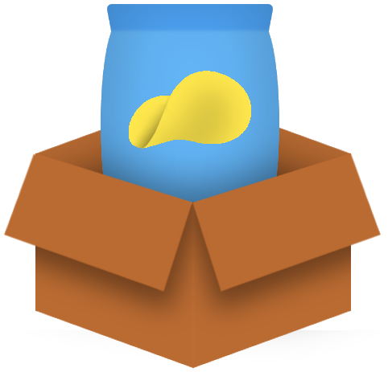
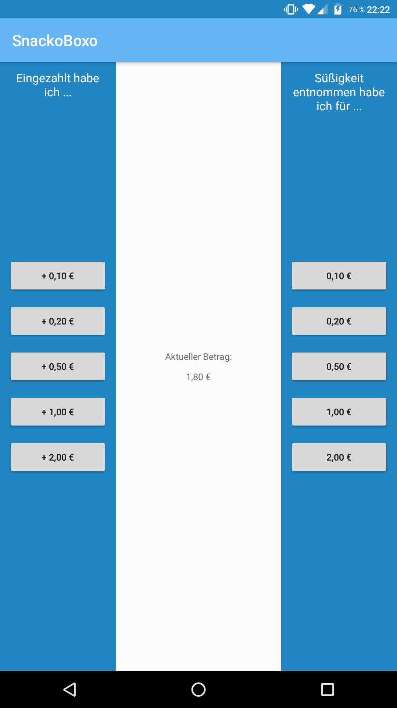

# SnackoBoxo
A simple app for snack boxes to remember how much money you have in the snack box.

## What is a "snack box"?
At work we have a so called *snackbox* from [snackbox.de](http://www.snackbox.de). The idea is to have a wooden box with candy and a slot for coins.

Sometimes the price for a piece of candy is odd (like 0,80€) and you don't have the exact amount of money with you.
You either have to put in more than neede or less and pay it back later.

SnackoBoxo helps you to keep track on how much credit/dept you have (because nobody can remember it after a few days/beer).

# Screenshot

# Features
* Add money to imaginary "account" 
(**left** side)
* Buy things (and remove money from "account") 
(**right** side)

# Future work
Features that might be nice

* History
* Statistics (e.g.: "How much have I payed in what week?")

